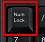
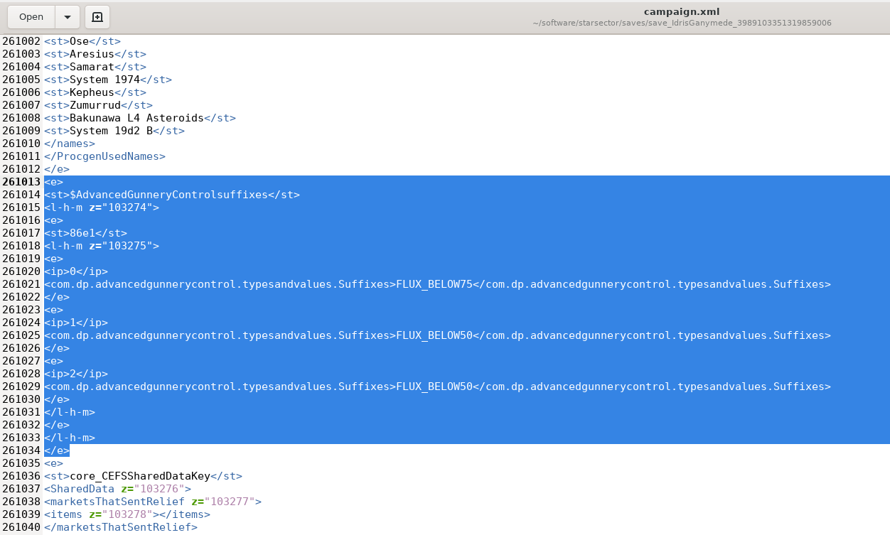

# Advanced Weapon Control - Starsector Mod #


This is a utility mod that allows you to set your auto-fire weapon groups to different modes.
For example, in PD-Only mode, weapons will ONLY fire at missiles and fighters, not at enemy ships.
This is especially useful for e.g. Bust PD Lasers, to not waste charges to deal soft-flux to enemy shields.
Check out the list of available modes below!

Sections of this readme are roughly ordered by importance. For the most important stuff, stop after Settings.

Note: If you don't have a markdown renderer handy, you can read the online version at 
<https://github.com/DesperatePeter/starsector-advanced-weapon-control/blob/master/README.md>

Also visit the forums post: <https://fractalsoftworks.com/forum/index.php?topic=21280.0>

## TL;DR Instructions ##

- Unzip the archive in your Starsector/mods folder
- Enable the NUMPAD-Numlock on your keyboard 
- Play the game and press NUMPAD-Keys during combat to cycle fire modes
- Target an ally (R-Key) in combat to cycle their firing modes
- By default, firing modes are automatically saved/loaded between combats (per ship)
- (optional) edit Starsector/mods/AdvancedGunneryControl/Settings.editme and add/remove modes you don't like etc.

## Installation ##

Simply download the latest release from <https://github.com/DesperatePeter/starsector-advanced-weapon-control/releases> 
and unzip it in your mods folder. 
If you install a new version, please make sure to delete the old folder before doing so.

## Controls ##

Press the NUMPAD Keys 1-7, to cycle between firing modes for that group. **Make sure to enable Num-Lock!**
Press the "-"-Key after 1-7 to cycle suffixes for that group.

Whenever you cycle modes, you will see a message like this:

```Group 2: [_X__] Missiles (custom AI) 2/3 Flux<90%```

In order, this let's you know that a) group 2 is in b) the second out of 4 modes, 
c) the current mode is Missiles, c) it's using custom AI when base AI wants to target something else,
d) 2 out of 3 weapons are eligible for that mode (the non-eligible weapon will use mode Default)
and e) (optional) the mode suffix prevents the weapon from firing if ship flux >= 90%.

When you deploy a ship in combat, its last used fire modes will be loaded automatically. You can disable this behaviour
in the settings.

Hotkeys (rebindable in Settings.editme):
- NUMPAD 1-7 - Cycle firing modes for weapon groups 1-7 for targeted or player ship (not rebindable)
- "J" - Show info about current firing modes (and load/save modes)
- "/" - Reset all modes back to default for current ship
- "*" - Manually load firing modes for all deployed ships
- "-" - Cycle suffix for the last group you cycled modes for
- "G" - Open the Gunnery Control GUI (only campaign mode, not rebindable)

Technical Note: Any key that represents the numbers 1 to 7 and isn't used by the base game will work.
So, if you rebind your weapon group keys (to e.g. F1-F7), you should be able to use the normal number keys.
If you bind the numpad numbers as secondary weapon group keys, this mod won't work at all.
If this becomes an issue for you, please let me know, and I will try to implement a solution.

### Setting fire modes for allied ships ###

You can simply set up fire modes for allied ships by running a simulation with them and adjusting fire modes. Alternatively,
you can target allied ships in combat by using the R-Key and then adjust their fire modes via the NUMPAD-Keys. The next 
time you deploy that ship, its fire modes will be loaded automatically. 

NOTE: The allied ship AI will "manually" fire weapons independent of their fire mode, but still often
rely on autofire. So, think of fire modes for allied ships as suggestions, not hard rules.

### Gunnery Control GUI ###

If you don't like having to set up your firing modes during (simulated) combat, there is also a dialog interface available.
Simply press the "G"-Key while on the campaign map, and the interface will guide you through configuring your
firing modes. Unfortunately, I **can't directly interface with
the ship refit screen**, so this is the best I can do.

## Fire Modes ##

Mode | Targets | Prioritizes | Requirements | Can use Custom AI | Weapon Example | Enabled by Default
:---: | :---   | :---        | :---         | :---:             | :---: | :---:
Default | Same as base AI | Same as base AI | None | No | All weapons | Yes
PD | Fighters/Missiles | Fighters/Missiles | PD Weapon | No | Flak | Yes
Fighters | Fighters | Fighters | None | Yes | Devastator Cannon | Yes
Missiles | Missiles (Mines/Flares) | Missiles | PD Weapon | Yes | Burst PD | Yes 
NoFighters | Anything but Fighters | Same as base AI | None | No | Hellbore Cannon | Yes
BigShips | Destroyers to Capitals | Bigger=Better | None | Yes | Squall MLRM | No
SmallShips | Fighters to Destroyers | Smaller=Better | None | Yes | Phase Lance | No
Mining | Asteroids | Asteroids | None | Yes | Mining Blaster | No

Note: If a weapon is not eligible for a certain mode, it will use its base AI as a fallback mode

Note: You need to manually add modes that are not enabled by default in the settings

### Mode Suffixes ###

Suffixes modify the behaviour of the selected fire mode in some way. Only one suffix may be applied.

Suffix | Effect
:---: | :---
NONE | None
Flux<90% | Weapon will hold fire if ship flux >= 90%
Flux<75% | Weapon will hold fire if ship flux >= 75%
Flux<50% | Weapon will hold fire if ship flux >= 50%

## Settings ##

The settings allow you to configure many aspects of the mod, most prominently: Whether to use custom AI or base AI only
and which fire modes you want to have access to and in which order you want to cycle through them.
There are more settings available, but you can ignore those unless you are feeling adventurous.

Simply open the file ***Settings.editme*** (located in the folder of this mod) in a text editor of your choice and modify the lines marked with <---- EDIT HERE ----

Please be careful to adhere to the syntax and allowed values. If your settings file contains errors, the mod will use
the default settings instead! Make sure to check the log (Starsector/starsector.log) if your settings don't apply!

### Enable Custom AI ###

There are three different AI settings:

- If the custom AI is **disabled**, the weapon will use the baseAI to acquire a target. If the target doesn't match
  the mode, the weapon won't fire. (base AI)
- (default) If the custom AI is **enabled**, the weapon will first try the base AI. If the target doesn't match, 
  the custom AI will take over. (custom AI)
- If you **force and enable** the custom AI, the weapon will immediately try to acquire a target via custom AI. (override AI)

You should **disable** the custom AI, if:

- You want an experience that is as close to vanilla Starsector as possible
- You absolutely hate it when your weapons occasionally fire at weird stuff (as my algorithm is still undergoing development, though mostly complete)

You should **enable or force-enable** the custom AI, if:

- You want to set weapons to prioritize targets they normally wouldn't (e.g. phase lances as anti-fighter weapons)
- You dislike it when your weapons don't fire even if there is a reasonable target
- You want to be able to customize the AI behaviour (in Settings.editme)
- You want to get the "full experience"
- You want to use Fighter/Missile-only modes
- You want to help me improve my custom AI by sending me written reports/video snippets of glitchy weapon behaviour

### Performance Considerations ###

This mod will have a negative effect on performance. That effect will range from barely noticeable to considerable,
depending on the settings. On my machine (which is ~9 years old), the mod generally doesn't have a noticeable impact unless
I go crazy in the settings. Below I will list a few options for improving performance:

- Either enable & force customAI, or disable it (as this prevents the occasional computation of two firing solutions).
- Try not to set every weapon group for every ship to a special fire mode.
- Leave the AI recursion level and friendly fire complexity at 1.
- Consider turning off auto save/load and instead manually save ("J"-Key) and load ("*"-Key).

## Troubleshooting ##

### Broken Saves ###

Note: I already fixed the issue that lead to this problem (now I only store strings rather than enums/objects). 
Unfortunately, I can't fix it retroactively...

If you get an error when loading a save that was using an old version of this mod (after updating/disabling this mod),
use the last version of this mod that worked with that save and disable the "enablePersistentFireModes" option.
Load the save again, and the mod will purge its persistent data. Save the game and update/remove the mod.

If that doesn't work, you can manually delete the data:
Open the campaign.xml in Starsector/saves/saveXYZ in a text editor of your choice.
Search for "$Advanced" and delete the lines from (including) ```<e>``` above ```<st>$AdvancedGunnery...</st>``` 
until the last ```</e>``` before the next ```<st>``` or ```</persistentData>```. Repeat until you don't find "$Advanced" anymore.



## How does the mod work? ##

In Starsector, each Weapon has a so-called AutofireAIPlugin. When that weapon is on autofire, this plugin will make the
decision where the weapon should aim and whether it should fire or not.

When you first toggle the autofire mode of a weapon, this mod will extract the original AutofireAIPlugin (AKA the base AI)
from the weapon and store it in a new Plugin called the AdjustableAIPlugin. Additionally, it will create a new Plugin for
every available autofire mode and also store it in the AdjustableAIPlugin. Then, whenever you toggle the autofire mode,
the AdjustableAIPlugin will check whether the plugin corresponding to the selected mode is compatible with the weapon.
If it is compatible, it will set the active Plugin to that plugin. Otherwise, it will simply set the default AutofireAIPlugin as active.

Each Plugin corresponding to an autofire mode also contains a reference to the base Plugin. Each time the plugin has to make
a decision, it first asks the base plugin what it would like to do. If that behaviour is in line with the selected mode,
the plugin will simply let the base AI do its thing. Otherwise, depending on whether customAI is enabled or not, it will
tell the weapon to not fire, or try to come up with its own firing solution.

### Compatibility with other mods ###

This mod should be compatible with other mods that provide custom AIs for their weapons, as long as they don't try to
manipulate the weapon AI mid-combat. This mod will simply use the custom AI of that weapon as the base AI.

If you are a mod-author and want to explicitly tell my mod to not tweak the AI of your weapon(s), include the weapon id
into your mod's modSettings.json:

```
{
  "AdvancedGunneryControl": {
    "weaponBlacklist": [
      "weapon_id_1", "weapon_id_2"
    ]
  }
}
```

This mod doesn't affect anything outside of combat, so it's very unlikely to cause problems on the campaign level.

## Roadmap ##

This is still a relatively early version. If you encounter any bugs, please let me know.

After some more testing, bug-fixing and implementing requested features,
I would like to add a feature where you can merge other weapon groups into your active weapon group.
Update: 0.95a-RC16 will probably fix the issue that was blocking this feature.

### Requested Features ###

- Add IgnoreFighters mode **DONE**
- Add ability to issue fire modes to AI-controlled allied ships **DONE**
- Add weapon-blacklist for other mods such that their weapons stay unaffected by fire modes from this mod **DONE**
- Automatically load fire modes on ship deployment **DONE**
- Add a GUI to set fire modes in the ship refit editor **DONE** (though not integrated in refit screen)
- Mode suffixes **DONE**

## Known Issues ##

- Depending on the machine/OS(?), keyboard inputs will not be accepted while holding SHIFT-Key.

If you happen to have any clues to fixing these issues, please let me know.

## Changelog ## 

- 0.1.0: Initial release
- 0.2.0: Added IgnoreFighters mode, added custom AI, added settings
- 0.2.1: Significant improvements to custom AI, including settings for custom AI
- 0.3.0: further improvements to custom AI (friendly fire), added weapon blacklist
- 0.3.1: minor polish and bugfixes
- 0.4.0: Experimental support for setting allied ship's fire modes, UI Settings
- 0.4.1: bugfix (allied ships were still referencing the player ship weapons), setting for info hotkey
- 0.5.0-ALPHA: fire modes are now exclusively stored on a per-ship-basis, meaning the data can be saved/loaded between combats
- 0.5.1: fire mode settings are now saved between saving/reloading, several bugfixes.
- 0.5.2: fixed bug where customAIFriendlyFireCaution had a much higher effect than intended
  changed it so that pressing J-Key is no longer required to initialize other ships.
- 0.5.3: In accordance with Wisp, removed dependency on Questgiver lib, 
  as that might cause compatibility issues with PerseanChronicles.
  fixed issue where refitting could cause weird behaviour (hopefully)
- 0.6.0: added 3 new fire modes, added reset function, fixed blacklist-bug, fixed several AI bugs, fixed issues with persistent storage
- 0.7.0: automatically load fire modes for all ships on combat start (opt-out in settings), 
  no longer need to be in Command UI to set friendly modes,  added hotkey to load fire modes for all ships
- 0.7.1: fix issue with reset key, adjusted readme
- 0.8.0: added mode suffixes, added gunnery control GUI
- 0.8.1: cleaned up GUI, display weapon mode suffixes

## Acknowledgements ##

Many thanks to Wisp for answering my endless questions about Kotlin and Starsector modding and for providing
an awesome repository template.

Thanks to LazyWizard for providing the LazyLib.

Thanks to stormbringer951 for inspiring me to create this mod by creating his mod Weapons Group Controls.

Last but not least: Thanks to everyone using this mod and giving me feedback!

## Support me ##

If you'd like to review my code and give me some hints what I could improve, please do! Also, feel free to create PRs!

If you happen to know how to make good videos, I'd very much appreciate if you could make a nice video showcasing the features
of this mod. If you came here from the Starsecor mod forum, you know why I'm asking for this xD

As you might know, writing the code is the easy part. Making sure that it works properly is where the challenge lies.
I'm grateful for any help with testing this mod. If you're willing to test unstable versions, while I'm working on the mode,
I usually release some pre-release builds. If you want to give me life feedback, you can DM me on Discord @Jannes#9184)

Do you have an idea for a cool new firing mode? Please feel free to contribute them!
Just follow the following steps:
- Create XyzAI class that inherits from (extends) AdjustableAIPlugin
- Extend FireMode.kt such that your fire mode appears in all relevant fields
- Add to readme-table
- Add to Settings.editme allowed-values comment (please refrain from adding to default list)
- Test that the mode works as intended!

On the off-chance that you want to support me financially, please don't :P My day-job as an engineer
pays enough to cover my living expenses.

I believe there are better places where you can donate your money to, check out
<https://fractalsoftworks.com/forum/index.php?topic=19739.0> for instance