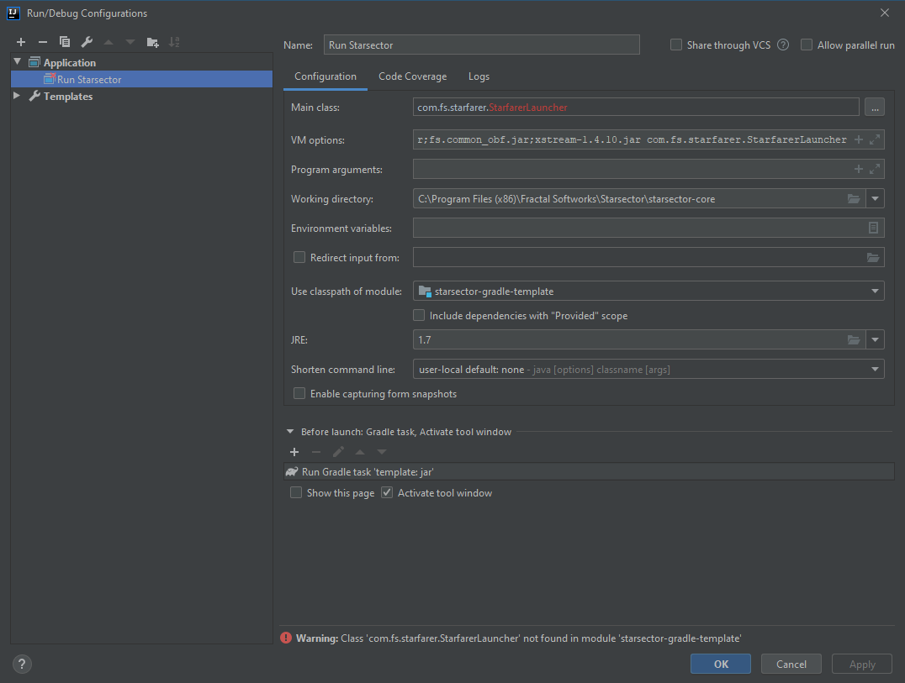

# Starsector Mod Template using Gradle and IntelliJ

## Description

This is a template for a Starsector mod that uses Gradle as its build system, Kotlin as the Gradle DSL, and Kotlin as the programming language.

One of the main goals is to move as much of the build process out of IntelliJ as possible, so that anybody can pull down the source code and build the project with minimal hassle. IntelliJ is not required to build the mod.

Another goal is to have more project configuration as code, rather than IDE-specific files. That way, they'll get versioned (and be shared, as mentioned).

Written for IntelliJ Community. Latest version is 2021.1 as of writing.

## Features

- A one-click command to build your mod and launch Starsector with full breakpoint debugging.
- Automatically generated `mod_info.json` and Version Checker files.
  - Set your mod's version once in `build.gradle.kts` and both files will be updated.
- A new GitHub Release will be created automatically whenever a git tag is pushed, if the mod is hosted on GitHub.
  - Delete the `.github` folder to disable this.

## Initial Setup Checklist

- [ ] Open `build.gradle.kts` and update all values in the `CHANGE ME` at the top.
- [ ] Change the package from the template default. In IntelliJ, open up `src/main/kotlin/com/example/template`, right-click on the first line (`package com.example.template`) and go to `Refactor - Rename`. From there, you may rename `com.example.template` to anything. If it pops up a refactoring preview, keep everything selected and click `Do Refactor`. 
- [ ] In `settings.gradle`, change `rootProject.name = 'template'` to be your new name instead.
  
### Optional

- Change `LICENSE` to something else. [Apache 2](https://tldrlegal.com/license/apache-license-2.0-(apache-2.0)) is a popular one.

## IntelliJ Configuration

### Ensure that your run configuration is correct:

- In IntelliJ, click `Run - Edit Configurations`.
- Select "Run Starsector"
- [ ] Set Working directory to the location of your `starsector-core` folder, if different than what's currently there.
- [ ] Check other values to make sure they fit your Starsector install. By default, they are set for a typical Windows install.
- Click Ok. You should now be able to choose Run Starsector from the Run menu and then click the Debug button (the icon of a bug) 
- Don't forget to enable your mod on the Starsector launch dialog!
- If you are running on linux, the VM Arguments should instead be
  
  ```-server -agentlib:jdwp=transport=dt_socket,server=y,suspend=y,address=5005 -Djava.library.path=./native/linux -Xms1536m -Xmx1536m -Xss2048k -classpath janino.jar:commons-compiler.jar:commons-compiler-jdk.jar:starfarer.api.jar:starfarer_obf.jar:jogg-0.0.7.jar:jorbis-0.0.15.jar:json.jar:lwjgl.jar:jinput.jar:log4j-1.2.9.jar:lwjgl_util.jar:fs.sound_obf.jar:fs.common_obf.jar:xstream-1.4.10.jar -Dcom.fs.starfarer.settings.paths.saves=./saves -Dcom.fs.starfarer.settings.paths.screenshots=./screenshots -Dcom.fs.starfarer.settings.paths.mods=./mods -Dcom.fs.starfarer.settings.paths.logs=. -Dcom.fs.starfarer.settings.linux=true com.fs.starfarer.StarfarerLauncher```

*Example for this template*



## Other

Author: Wispborne (Wisp#0302 on the Unofficial Starsector Discord)

License: [Unlicense](https://github.com/davidwhitman/starsector-mod-template/blob/master/LICENSE)
