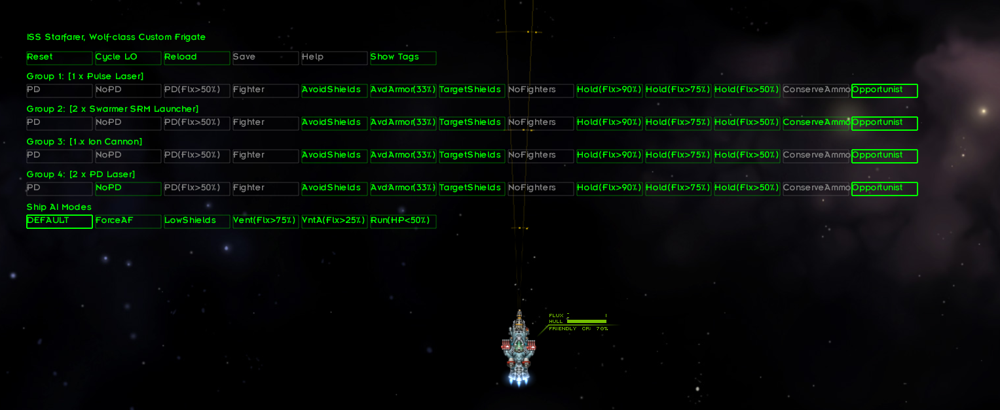

# Advanced Weapon Control - Starsector Mod #



This is a utility mod that allows you to set your auto-fire weapon groups to different modes.
For example, in PD-Only mode, weapons will ONLY fire at missiles and fighters, not at enemy ships.
There are many modes, check out the full list of available modes below!

Sections of this readme are roughly ordered by importance. For the most important stuff, stop after Settings.

Note: If you don't have a markdown renderer handy, you can read the online version at 
<https://github.com/DesperatePeter/starsector-advanced-weapon-control/blob/master/README.md>

Also visit the forums post: <https://fractalsoftworks.com/forum/index.php?topic=21280.0>

## TL;DR Instructions ##

- Press the "J" key in combat to open up a GUI (select an ally via "R" key beforehand to modify their modes)
- Press the "J" key in the campaign map to open a GUI
- By default, firing modes are automatically saved/loaded between combats (per ship)
- (optional) edit Starsector/mods/AdvancedGunneryControl/Settings.editme to customize the mod behavior.

## Installation ##

Simply download the latest release from <https://github.com/DesperatePeter/starsector-advanced-weapon-control/releases> 
and unzip it in your mods folder. 
If you install a new version, please make sure to delete the old folder before doing so. Backup you Settings.editme 
if you wish to keep it.

## Controls (Combat) ##

Press the "J"-Key to open up a GUI. This will pause the game and lock the camera. Press "J" again to close the GUI.

Target an ally ("R"-Key) **before** opening the GUI to instead adjust their modes.

In that GUI, you will be able to apply one or more tags to each weapon group. Each added tag will change the target 
priority of that weapon group and/or prevent it from firing in certain situations. Please note that a weapon group
will only fire if **all** suffixes allow firing, so if you e.g. set a weapon group to Hold(Flx>50%) and Fighters, it will
only fire when your ship's flux is below 50% and will only target fighters.
Rule of thumb: Usually, less is more. Don't set too many tags if you want your weapons to actually fire.
Note that tags only affect weapon groups set to autofire.

You can also set ship AI modes in a very similar fashion. These will only affect AI-controlled ships, not the player ship.

### Gunnery Control GUI ###

If you don't like having to set up your ships firing modes during (simulated) combat, there is also a campaign GUI available.
Simply press the "J"-Key while on the campaign map, and the interface will guide you through configuring your
firing modes. Unfortunately, I **can't directly interface with the ship refit screen**, which would be much better,
so this is the best I can do.

### Loadouts ###

You can define (by default 3) different mode loadouts for your fleet. You can then cycle through these loadouts for all
ships by pressing the "+"-Key in combat or clicking the corresponding button in the GUI. Doing so will switch all firing modes,
suffixes and ship modes to those defined in the next loadout. Loadouts are cycled fleet-wide, not per ship.

You can configure the number of available loadouts and their names in the Settings.editme file.

I would recommend leaving one loadout blank (i.e. everything default) for your entire fleet to give you a fallback option.

## Tags ##

Note: Not all tags are enabled by default, cf. Settings.editme to customize which tags are available
If you have ConsoleCommands installed, you can also hotload new tags via AGC_addTags.
Ship refers to a non-fighter ship in the table below
Replace N with a number between 1 and 99 when the tag name contains N%

|      Tag       | Targets                        | Prioritizes                                          | Requirements  |       Uses Custom AI When       |                                                                       Comments                                                                       |                                 Incompatible with                                 | Suggested Use Case                                                                       | Recommended as suggested tag? |
|:--------------:|:-------------------------------|:-----------------------------------------------------|:--------------|:-------------------------------:|:----------------------------------------------------------------------------------------------------------------------------------------------------:|:---------------------------------------------------------------------------------:|:-----------------------------------------------------------------------------------------|:------------------------------|
|       PD       | Fighters/Missiles              | Fighters/Missiles                                    | PD Weapon     |               No                |                                                            Will never shoot regular ships                                                            |         "Fighter", "Opportunist", "NoPD", "PD(Flx>N%)", "Big/SmallShips"          | Weapons that only make sense as PD weapons and shouldn't waste shots/flux on enemy ships | Yes                           |
|    Fighters    | Fighters                       | Fighters                                             | None          |   Base AI targets non-fighter   |                                                                          -                                                                           | "PD", "NoFighters", "Opportunist", "NoPD", "PD(Flx>N%)", "BigShips", "SmallShips" | Dedicated Anti-Fighter Weapons                                                           | Usually not                   |
|      NoPD      | Ships, Fighters                | Ships                                                | PD Weapon     |       Target is not Ship        |                                                         Doesn't change weapon classification                                                         |                           PD", "Fighter", "PD(Flx>N%)"                            | Weapons that have the PD tag but aren't really PD weapons, e.g. MachineGuns              | No                            |
|  PrioritisePD  | Everything                     | Missile > Fighter > small ship > big ship            | None          |             Always              |                                             Consistently prioritises smaller targets over larger targets                                             |            "Opportunist", "NoPD", "BigShips", "SmallShips", "Fighter"             | Any weapon that needs to reliably prioritise fighters and missiles over ships            | Yes                           |
|   NoFighters   | Anything but Fighters          | Same as base AI                                      | None          |    base AI targets a fighter    |                                                                          -                                                                           |                             "Fighter", "Opportunist"                              | Low rate of fire, slow projectile speed                                                  | Yes                           |
|  Opportunist   | Ignores fighters/missiles      | Special*                                             | None          |             Always              |                                             Only shoots when the shot is likely to hit and be effective                                              |                    "Fighter", "PD", "NoFighters", "PD(Flx>N%)"                    | Weapons with severely limited ammo or extreme re-fire delay                              | Yes                           |
|    BigShips    | Ships/Fighters                 | Bigger=Better                                        | None          |  base AI targeting Destroyer-   |                                                          cf. strict mode in Settings.editme                                                          |                    "SmallShips", "PD", "Fighter", "PD(Flx>N%)"                    | Low rate of fire, slow projectile speed                                                  | No                            |
|   SmallShips   | Ships/Fighters                 | Smaller=Better                                       | None          |  base AI targeting Destroyer+   |                                                          cf. strict mode in Settings.editme                                                          |                     "BigShips", "PD", "Fighter", "PD(Flx>N%)"                     | Precise, fast firing weapons or Cone/AoE                                                 | No                            |
|  AvoidShields  | Anything                       | ships without shields or high flux                   | None          |    base AI targets shielded     |                                                     Will target missiles if applied to PD weapon                                                     |                                other shield modes                                 | Weapons that are ineffective vs shields                                                  | Yes                           |
| TargetShields  | Anything (usually no missiles) | ships with shields and low flux                      | None          |   base AI targets unshielded    |                                                     Does take shield flanking into consideration                                                     |                                other shield modes                                 | Weapons that are only effective against shields (e.g. needlers)                          | Yes                           |
|  PD(Flux>N%)   | Varies                         | Same as default when flux < N%, otherwise same as PD | PD Weapon     |               No                |                                                                          -                                                                           |                                      cf. PD                                       | Flux-hungry PD weapons (e.g. Flak Cannons)                                               | No                            |
|  AvdArmor(N%)  | Everything                     | Low armor targets                                    | None          |   base AI targets high armor    |                                   Only fires if weapon will deal at least N% damage to armor (not counting skills)                                   |                                         -                                         | Weapons that are ineffective vs armor                                                    | Yes                           |
|   AvdDebris    | -                              | -                                                    | None          |               No                |                                               Only affects custom AI, i.e. always use with other tags                                                |                                         -                                         | Limited ammo weapons or very high flux weapons                                           | No                            |
|  ConserveAmmo  | Varies                         | Varies                                               | uses ammo     |        weapon ammo < 50%        |                                                       Behaves like opportunist when ammo < 50%                                                       |                                         -                                         | Limited ammo weapons with decent ammo or regenerating charges                            | No                            |
| ConservePDAmmo | Varies                         | -                                                    | uses ammo, PD |        weapon ammo < 90%        |                                             When ammo < 90%, only fighters and missiles can be targeted                                              |                              "PD", "Fighter", "NoPD"                              | Limited ammo PD weapons that you still want to get some use from against non PD targets  | Usually not                   |
|  Hold(Flx>N%)  | -                              | -                                                    | None          |               No                |                                                      Will stop firing when ship flux exceeds N%                                                      |                                         -                                         | high flux weapons                                                                        | Very                          |
|    ForceAF     | -                              | -                                                    | None          |                -                | Forces ShipAI to set affected weapon group to autofire. Will install custom ShipAI! For weapons that use flux, definitely combine with Hold(Flx>N%)! |                                         -                                         | Weapons where the AI is too hesitant to fire. Combine with other tags.                   | Usually not                   |
|  Panic(H<N%)   | -                              | -                                                    | None          |             Hull<N%             |                                          When Hull<N%, weapon always fires and ForceAF mode gets turned on                                           |                                         -                                         | Limited ammo missiles with tracking.                                                     | Usually not                   |
|  AvoidPhased   | Anything                       | Non-phased                                           | None          |   base AI targets phase ships   |   Will avoid phase ships, unless they are vulnerable (phased and almost fluxed out or not phased and phase cooldown lasts until predicted impact)    |                                         -                                         | When you are annoyed with weapons shooting at phase ships to no avail.                   | Usually not                   |
|   ShipTarget   | Ships/Fighters                 | Ship-Target (selected via R-Key)                     | None          | base AI doesn't target ship-tgt |                                                                          -                                                                           |                                         -                                         | Charge-based weapons that you don't want wasting shots against secondary targets         | Usually not                   |
|    Range<N%    | Anything                       | -                                                    | None          |   base AI target out of range   |            Limits the range at which the weapon will shoot/target to N% base range. Note that predicted, not actual, locations are used.             |                                         -                                         | Slow-traveling projectiles or shotgun-style weapons (e.g. devastator)                    | Sometimes                     |
| ForceF(Flx<N%) | -                              | -                                                    | None          |                -                |                         Circumvents firing restrictions (not targeting restrictions) of other tags such as e.g. AvoidShields                         |                                         -                                         | Fire weapons more liberally while ship has flux to spare                                 | No                            |
|   Overloaded   | Overloaded ships               | Overloaded ships                                     | None          | Base AI targets non-overloaded  |                                                                          -                                                                           |                                         -                                         | Finisher-type weapons                                                                    | No                            |
|   ShieldsOff   | Targets without active shields | Targets without active shields                       | None          |     Base AI targets shields     |                    This is simple boolean logic. If a target has no shields or its shields are turned off, it will get targeted.                     |                                other shield modes                                 | Was requested for EMP weapons, so EMP weapons I guess?                                   | No                            |

## Settings ##

The settings allow you to configure many aspects of the mod.

Simply open the file ***Settings.editme*** (located in the folder of this mod) in a text editor of your choice 
and modify the lines marked with <---- EDIT HERE ----

Please be careful to adhere to the syntax and allowed values. If your settings file contains errors, the mod will use
the default settings instead! Make sure to check the log (Starsector/starsector.log) if your settings don't apply!

### Enable Custom AI ###

There are three different AI settings:

- If the custom AI is **disabled**, the weapon will use the baseAI to acquire a target. If the target doesn't match
  the tags, the weapon won't fire. (base AI)
- (default) If the custom AI is **enabled**, the weapon will first try the base AI. If the target doesn't 
  match the selected tags, the custom AI will take over. (custom AI)
- If you **force and enable** the custom AI, the weapon will immediately try to acquire a target via custom AI. (override AI)

You should **disable** the custom AI, if:

- You want an experience that is as close to vanilla Starsector as possible
- You absolutely hate it when your weapons occasionally fire at weird stuff (as my algorithm is still undergoing development, though mostly complete)

You should **enable or force-enable** the custom AI, if:

- You want to set weapons to prioritize targets they normally wouldn't (e.g. phase lances as anti-fighter weapons)
- You dislike it when your weapons don't fire even if there is a reasonable target
- You want to be able to customize the AI behaviour (in Settings.editme)
- You want to use advanced tags (Opportunist etc.)
- You want to get the "full experience"
- You want to help me improve my custom AI by sending me written reports/video snippets of glitchy weapon behaviour

### Performance Considerations ###

This mod will have a negative effect on performance. That effect will range from barely noticeable to considerable,
depending on the settings. On my machine (which is ~9 years old), the mod generally doesn't have a noticeable impact unless
I go crazy in the settings. Below I will list a few options for improving performance:

- Either force customAI, or disable it (as this prevents the occasional computation of two firing solutions).
- Try not to set every weapon group for every ship to a special fire mode.
- Leave the AI recursion level and friendly fire complexity at 1.
- Stick to ship mode Default (unfortunately, the ship mode implementation is a little hacky and performance intensive)

## How does the mod work? ##

In Starsector, each Weapon has a so-called AutofireAIPlugin. When that weapon is on autofire, this plugin will make the
decision where the weapon should aim and whether it should fire or not.

When you first set tags for a weapon, this mod will extract the original AutofireAIPlugin (AKA the base AI)
from the weapon and store it in a new Plugin called the TagBasedAIPlugin. Then, the selected tags are added to that plugin.
In each frame, the TagBasedAIPlugin will consult all tags and make decisions based on the combined results.

The TagBasedAIPlugin also contains a reference to the base Plugin. Each time the plugin has to make
a decision, it first asks the base plugin what it would like to do. If that behaviour is in line with the selected tags,
the plugin will simply let the base AI do its thing. Otherwise, depending on whether customAI is enabled or not, it will
tell the weapon to not fire, or try to come up with its own firing solution.

If the tag list for a weapon group is empty, the base AI will not be replaced.

Similarly, when setting ship AI modes, the mod will replace the base ship AI plugin with a custom plugin that will perform
some actions and then let the base AI take back over.

### Compatibility and Integration with other mods ###

This mod should be compatible with other mods that provide custom AIs for their weapons, as long as they don't try to
manipulate the weapon AI mid-combat. This mod will simply use the custom AI of that weapon as the base AI.
This mod doesn't affect anything outside of combat, so it's very unlikely to cause problems on the campaign level.

If you are a mod-author and want to explicitly tell my mod to not tweak the AI of your weapon(s), include the weapon id
into your mod's modSettings.json:

```
{
  "AdvancedGunneryControl": {
    "weaponBlacklist": [
      "weapon_id_1", "weapon_id_2"
    ]
  }
}
```

Similarly, this mod has a feature for suggested tags for weapons. If you want to include suggested tags for your
weapons to allow users to quickly set up their tags, include a key suggestedWeaponTags in your modSettings.json.
Have a look at this mod's modSettings.json for an example. Refer to the tag table above to decide on tags.
If in doubt, the safe bet is always to simply omit a weapon and assign no tags.

#### Assigning tags to enemy ship weapons ####

If you want enemy ships of your mod to have tags assigned to their weapons, you can tell my mod to do so by setting
custom data to the ship. You can do that however you want to, the easiest solutions probably being a hullmod-script
or a BaseEveryFrameCombatPlugin/BaseEveryFrameCombatScript.

Use the setCustomData-method of the ShipAPI. Use the key "AGC_ApplyCustomOptions" and a Map<String, List<String>> as the value.
My mod will parse that value, apply the desired tags to the applicable weapons (Note: Tags are applied on a per-weapon basis
rather than on a per-weapon-group basis for enemy ships) and then remove the entry from the custom ship data.
After it's finished, it will write the key "AGC_CustomOptionsHaveBeenApplied" to the custom data, so you can search
for that key to see if tags have already been applied to a ship (though my mod doesn't check that key).

The map must adhere to the following syntax:

Its keys can be:
- a weapon id -> will affect all weapons with exactly this id
- "!MAGIC!Missile", "!MAGIC!Energy" or "!MAGIC!Ballistic" -> will affect all missiles/energy weapons/ballistics
- a regex-string -> will affect all weapons with ids that match the regex

The values must be lists of tag-names.
All tags listed will be applied to all weapons that match the given key.

For instance, if you want all missile weapons to receive the ForceAF and NoFighters tags, the following call should get the job done:

```kotlin
// Kotlin
// assuming ship is an object of type ShipAPI
ship.setCustomData("AGC_ApplyCustomOptions", mapOf("!MAGIC!Missile" to listOf("ForceAF", "NoFighters")))
```

```java
// Java
// ship.setCustomData("AGC_ApplyCustomOptions", Collections.singletonMap("!MAGIC!Missile", Arrays.asList("ForceAF", "NoFighters")));
```

If you want to check whether AGC has been installed/loaded by the user:
It will write the key "AGC_Present" to the CombatEngine custom data.

#### Using the combat gui library ####

I wrote a repo-internal library that's used to implement the AGC in-combat GUI. You can import the library
from the package com.dp.advancedgunnerycontrol.combatgui. The AGC-implementation is in the subfolder agccombatgui.
Everything else is part of the library.
To use the library, add AGC as a dependency to your mod and load the AGC-jar.
In the future I might move this to a library-mod. If any lib-collection maintainer would be interested in including this,
please let me know!
You can find a usage example of the library here: <https://github.com/DesperatePeter/test-combat-gui-lib>

## Known Issues ##

- Versions before 0.8.2 saved custom classes as persistent data, meaning it was not possible to remove the mod.

## Changelog ## 

- 0.1.0: Initial release
- 0.2.0: Added IgnoreFighters mode, added custom AI, added settings
- 0.2.1: Significant improvements to custom AI, including settings for custom AI
- 0.3.0: further improvements to custom AI (friendly fire), added weapon blacklist
- 0.3.1: minor polish and bugfixes
- 0.4.0: Experimental support for setting allied ship's fire modes, UI Settings
- 0.4.1: bugfix (allied ships were still referencing the player ship weapons), setting for info hotkey
- 0.5.0-ALPHA: fire modes are now exclusively stored on a per-ship-basis, meaning the data can be saved/loaded between combats
- 0.5.1: fire mode settings are now saved between saving/reloading, several bugfixes.
- 0.5.2: fixed bug where customAIFriendlyFireCaution had a much higher effect than intended
  changed it so that pressing J-Key is no longer required to initialize other ships.
- 0.5.3: In accordance with Wisp, removed dependency on Questgiver lib, 
  as that might cause compatibility issues with PerseanChronicles.
  fixed issue where refitting could cause weird behaviour (hopefully)
- 0.6.0: added 3 new fire modes, added reset function, fixed blacklist-bug, fixed several AI bugs, fixed issues with persistent storage
- 0.7.0: automatically load fire modes for all ships on combat start (opt-out in settings), 
  no longer need to be in Command UI to set friendly modes,  added hotkey to load fire modes for all ships
- 0.7.1: fix issue with reset key, adjusted readme
- 0.7.2: IPDAI is now considered for PD/Missiles mode, invalid modes are now skipped (opt-out in settings)
- 0.8.0 (pre-release): added mode suffixes, added gunnery control GUI
- 0.8.1 (pre-release): cleaned up GUI, display weapon mode suffixes
- 0.8.2: add ability to cycle suffixes during combat, fix issues with persistence and save game corruption
- 0.8.3: minor polish
- 0.8.4: pre-deployed ships (e.g. when trying to disengage) will now also automatically load firing modes
- 0.8.5: automatically purge incompatible persistent data, changed GUI hotkey to "J" and made it rebindable
- 0.9.0 (pre-release): Added loadouts, ship modes & additional modes/suffixes
- 0.9.1 (pre-release): Fixed an issue that could lead to a nullptr-exception
- 0.9.2: Fixed issues (suffixes didn't properly affect targeting priority, ship modes got occasionally reset),
  added additional ship modes.
- 0.10.1: Added targetShields/avoidShields modes, possibility to activate multiple ship AI modes, reworked opportunist, 
  added mode parameters to options
- 0.10.2: Yet another Opportunist overhaul (now less conservative for weapons with unlimited ammo, new setting), minor bugfixes
- 0.10.4: Fixed issues with friendly fire, fixed several issues with target acquisition, turrets now assume a neutral position
- 0.11.0: Reworked Target/AvoidShields, reworked most of the custom AI to fix some issues (improved aim, friendly fire, target prio)
- 0.12.0: Converted PD(Flux>50%) and PD(Ammo<50%) to fire modes, the latter disabled by default. GUI polish. 
  Added suggested weapon modes (prototypical). Added setting for strict/lenient BigShip/SmallShip modes.
- 0.12.1: Add variant mode copying, help hotkey, additional settings (technically, this should have been 0.13.0)
- 0.13.0: add noPD mode (disabled by default), polish
- 0.13.1: refactor GUI dialogue options, add setting to disable automatic in-combat persistence.
- 0.13.2: minor fixes and dependency upgrades
- 1.0.0: Big rework: Replace in-combat hotkeys with a GUI, replace weapon modes and suffixes with a tag system
- 1.1.0: Fix issues (combat GUI with screenScale, clicking noise, settings), add customizable thresholds and new tags
- 1.1.1: Fix issues with combat UI scaling/positioning, fix issues with PD-tags
- 1.2.0: Remove legacy mode, fix several issues related to weird weapon AI behavior, add additional tags, cleanup & polish
- 1.3.0: Add ForceAF tag and hotloading tags, tweaked several tags for less restrictive targeting, fix issues with base AI selection
- 1.4.0: Add option for other mods to set tags for enemy ships via custom ship data
- 1.4.1: Fix AvoidArmor-tag; fix issue with ship modes getting stripped when transferring control (via occasionally reloading ship modes)
- 1.5.0: Add AvoidPhased-tag; Various small weapon AI tweaks; Add Console Command tag hotloading 
- 1.6.0: Weapon charge time is now taken into consideration when computing projectile travel time. Add Range<N% and ShipTarget tags. 
         Split combat-GUI into lib and AGC-implementation. Fix issue causing crash when opening combat GUI with no flagship deployed.
         Tuned default settings.
- 1.6.1: Fix TargetShields+, turn jar into a pom-style library to allow for displaying javadoc in IDE
- 1.7.0: Tag scrollbar, add new tags, add option to ignore fighter shields (special thanks to Seanra for contributing most of the new stuff!)
- 1.7.1: Fix an issue with weapons that need to be aimed firing without aiming (special thanks to Genir!). 
         Fix an issue with PrioritizePD not ignoring flares with IPDAI.
         (Hopefully) fix potential memory leak caused by in-combat-GUI.
- 1.8.0: Add two new tags; ship module modes now persist; fix range tag for non-aimable weapons; 
         UI improvements (advanced/simple mode, weapon highlighting, dynamic option names); 
         Combat GUI lib: Add overrideable onHover method to group actions.

## Acknowledgements ##

Special thanks to Seanra for contributing the option to ignore fighter shields and the PrioritisePD, TgtShieldsFT, AvdShieldsFT
and ConservePDAmmo tags!

Special thanks to Genir for fixing an issue where weapons that should be aimed were incorrectly assumed to be non-aimable.
And many more thanks to Genir for his efforts of refactoring, improving code quality and performance!

Many thanks to Wisp(borne) for answering my endless questions about Kotlin and Starsector modding and for providing
an awesome repository template.

Thanks to LazyWizard for providing the LazyLib.

Thanks to stormbringer951 for inspiring me to create this mod by creating his mod Weapons Group Controls.

Last but not least: Thanks to everyone using this mod and giving me feedback!

## Support me ##

If you'd like to review my code and give me some hints what I could improve, please do! Also, feel free to create PRs!

If you happen to know how to make good videos, I'd very much appreciate if you could make a nice video showcasing the features
of this mod. If you came here from the Starsector mod forum, you know why I'm asking for this xD

As you might know, writing the code is the easy part. Making sure that it works properly is where the challenge lies.
I'm grateful for any help with testing this mod.

Do you have an idea for a cool new tag? Please feel free to contribute them!

On the off-chance that you want to support me financially, please don't :P 
